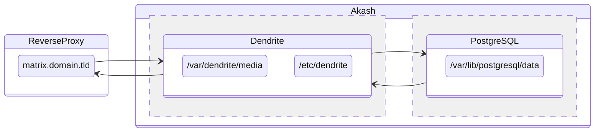

# Matrix Dendrite

Dendrite is a second-generation Matrix homeserver written in Go.
It intends to provide an **efficient**, **reliable** and **scalable** alternative to [Synapse](https://github.com/matrix-org/synapse).  
See [Dendrite repository](https://github.com/matrix-org/dendrite) for more information.

## Overview



## Deploy on Akash

To deploy Dendrite on Akash, simply use and modify `deploy.yml`.  
Change the environment variable `SERVER_NAME` of the Dendrite service to match your domain.

## Build

```sh
make build push
```